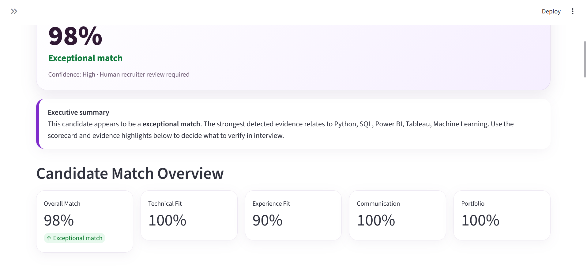
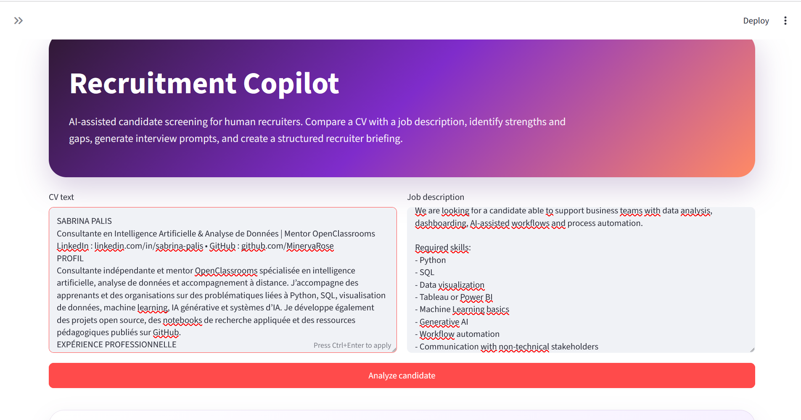
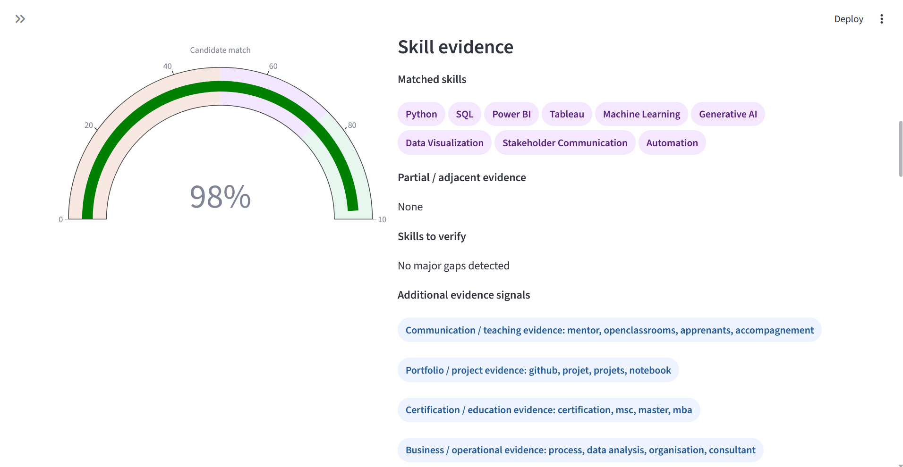
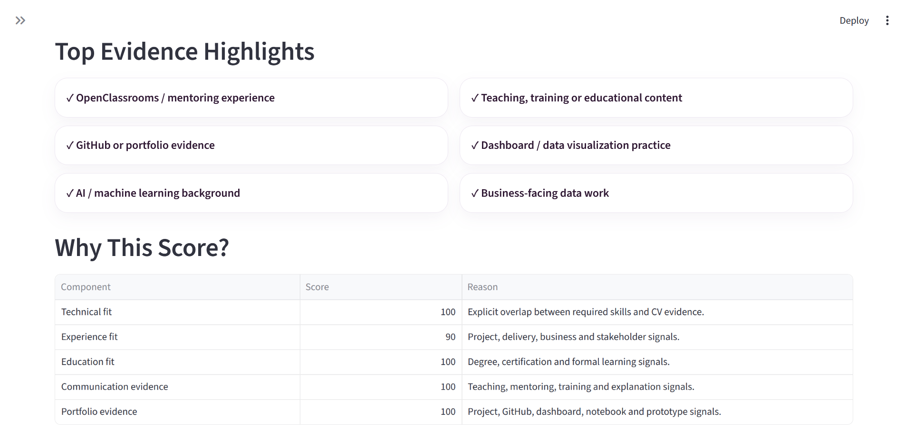
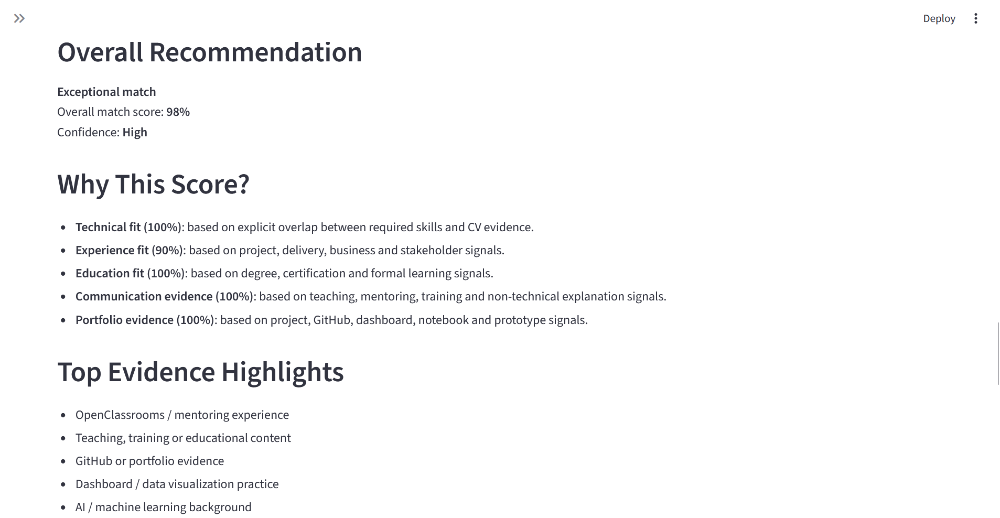
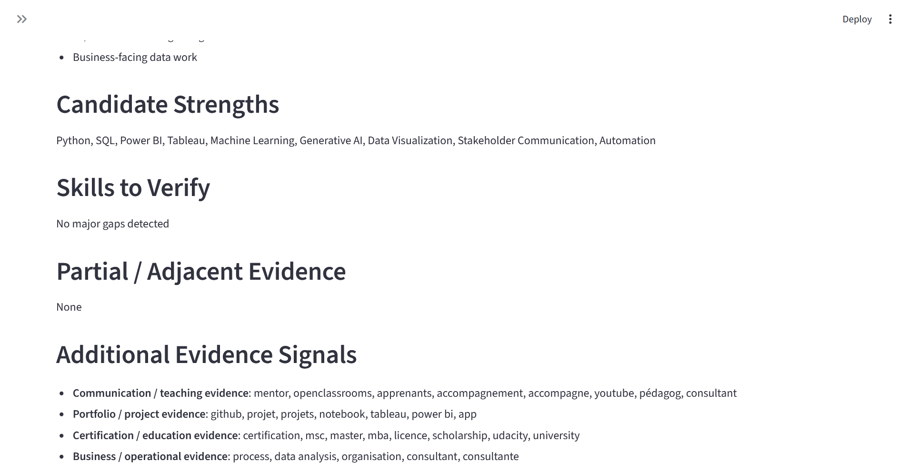
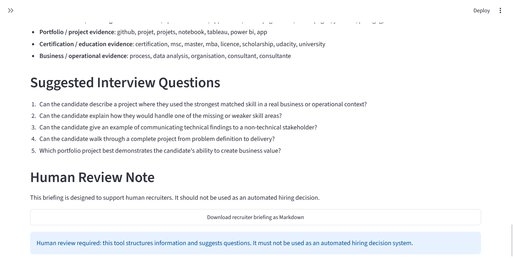

<div align="center">

# 🧭 Recruitment Copilot

### AI-Assisted Recruitment Intelligence & Candidate Assessment


A recruiter-facing decision-support system that transforms candidate documents into structured hiring intelligence.

The repository includes a complete demonstration using a real AI & Data candidate profile, example recruiter briefing, and dashboard screenshots generated by the application.

Recruitment Copilot compares CVs against job descriptions, extracts evidence signals, evaluates candidate fit, highlights strengths and verification points, and generates recruiter-ready interview briefings.

Designed as a transparent human-in-the-loop workflow rather than a black-box hiring system.

<p align="center">
  
</p>

</div>

---

## 🚧 Project Status

> **Work in Progress (MVP)**
>
> The current version uses deterministic skill matching and evidence extraction to demonstrate a complete recruitment decision-support workflow.
>
> Future versions will incorporate LLM-assisted analysis, richer document parsing, automation integrations, and multi-candidate workflow capabilities.

---

## 📸 Live Demonstration

The screenshots below demonstrate the system analyzing a real-world AI & Data candidate profile and generating a structured recruiter briefing.

### Candidate Input

<p align="center">
  
</p>

The candidate CV and job description are provided to the system for analysis.

---

### Executive Assessment

<p align="center">
  
</p>

The system generates an overall recommendation, confidence level, and executive summary.

---

### Candidate Match Overview

<p align="center">
  
</p>

Technical fit, communication signals, portfolio evidence, and overall candidate alignment are evaluated.

---

### Evidence Signals

<p align="center">
  
</p>

The system identifies explicit skill matches and additional evidence categories including:

* Communication & mentoring signals
* Portfolio evidence
* Certification evidence
* Business & operational experience

---

### Evidence Highlights & Score Explanation

<p align="center">
  
</p>

The recruiter can inspect the reasoning behind the assessment through transparent score breakdowns and evidence highlights.

---

### Recruiter Briefing

<p align="center">
  
</p>

A structured recruiter briefing is automatically generated to support interview preparation.

---

### Interview Preparation

<p align="center">
  
</p>

Suggested interview questions are generated based on the detected evidence and candidate profile.

---

## 📄 Generated Recruiter Briefing

A complete recruiter briefing generated from the example candidate analysis is included in this repository.

➡️ **[View Generated Recruiter Briefing](outputs/sabrina_palis_recruiter_briefing%283%29.md)**

The demonstration uses a real AI & Data professional profile to showcase the system's evidence extraction, scoring, recommendation engine, and recruiter briefing capabilities.

The generated report includes:

* Executive summary
* Match assessment
* Evidence highlights
* Candidate strengths
* Skills to verify
* Interview preparation questions
* Human review guidance

---

## ✨ Why This Project?

Recruiters and hiring managers often review large numbers of applications under significant time pressure. Valuable information can be overlooked, while evaluation quality may vary between reviewers.

Recruitment Copilot explores how AI-assisted workflows can help structure candidate information into consistent, explainable assessments without replacing human judgment.

The objective is not to automate hiring decisions.

The objective is to reduce administrative friction, improve review consistency, and help recruiters focus their time on higher-value conversations with candidates.

---

## 🔄 Operational Workflow

```text
CV + Job Description
          │
          ▼
Evidence Extraction
          │
          ▼
Skill Matching
          │
          ▼
Fit Assessment
          │
          ▼
Evidence Verification
          │
          ▼
Interview Preparation
          │
          ▼
Recruiter Briefing
```

The current MVP identifies:

* Technical skill alignment
* Experience signals
* Communication and mentoring evidence
* Portfolio and project evidence
* Education and certification signals
* Business and operational experience indicators

All outputs remain subject to human review.

---

## 🧩 Features

### Candidate Assessment

* Upload or paste a CV
* Upload or paste a job description
* Automatic skill extraction
* Technical fit scoring
* Experience fit scoring
* Education fit scoring
* Communication evidence detection
* Portfolio evidence detection

### Evidence Analysis

* Matched skills
* Skills requiring verification
* Partial or adjacent evidence
* Teaching and mentoring signals
* Certification signals
* Business and operational signals

### Recruiter Support

* Executive summary
* Recommendation tier
* Evidence highlights
* Transparent score breakdown
* Interview preparation questions
* Recruiter briefing generation
* Markdown export

---

## 🖥️ Dashboard Components

The application currently includes:

* Executive summary card
* Recommendation card
* Candidate match KPI cards
* Match gauge visualization
* Skill evidence section
* Evidence signal detection
* Top evidence highlights
* Score explanation panel
* Recruiter scorecard
* Recruiter briefing report
* Downloadable Markdown briefing

---

## 📸 Example Output

The system generates:

* Overall match score
* Recommendation level

Examples:

```text
Exceptional Match
Strong Potential Fit
Possible Fit
Partial Fit
Weak Fit
```

And produces a structured recruiter briefing including:

* Executive summary
* Candidate strengths
* Skills to verify
* Evidence highlights
* Interview questions
* Human review note

---

## 📁 Project Structure

```text
recruitment-copilot/
│
├── app.py
├── requirements.txt
├── README.md
├── .gitignore
│
├── sample_data/
│   ├── sample_cv.txt
│   └── sample_job_description.txt
│
├── src/
│   ├── scoring.py
│   ├── report_generator.py
│   └── text_utils.py
│
├── images/
│   ├── image-1.png
│   ├── image-2.png
│   ├── image-3.png
│   ├── image-4.png
│   ├── image-5.png
│   ├── image-6.png
│   └── image-7.png
│
└── outputs/
```

---

## 🚀 Run Locally

Clone the repository:

```bash
git clone https://github.com/YOUR-USERNAME/recruitment-copilot.git
cd recruitment-copilot
```

Create a virtual environment:

```bash
python -m venv .venv
```

Windows:

```bash
.venv\Scripts\activate
```

macOS/Linux:

```bash
source .venv/bin/activate
```

Install dependencies:

```bash
pip install -r requirements.txt
```

Run the application:

```bash
streamlit run app.py
```

Or:

```bash
python -m streamlit run app.py
```

---

## 🧠 Current Scoring Logic

The MVP uses deterministic matching and evidence-based scoring.

The assessment currently combines:

* Technical skill alignment
* Experience indicators
* Education and certification signals
* Communication and mentoring evidence
* Portfolio and project evidence

The goal is explainability rather than black-box prediction.

---

## ⚖️ Responsible AI Note

Recruitment Copilot is a human decision-support prototype.

It is designed to:

* Organize evidence
* Support recruiter preparation
* Improve review consistency
* Reduce administrative workload

It is not designed to:

* Automatically hire candidates
* Automatically reject candidates
* Replace recruiter judgment

Recruitment decisions require human review, contextual understanding, fairness checks, and compliance with applicable employment law.

---

## 🔮 Future Vision

Recruitment Copilot is the first component of a broader exploration into AI-assisted operational systems.

Future versions will evolve from explainable screening toward recruiter workflow automation, candidate pipeline intelligence, and human-in-the-loop hiring support.

---

## 🌱 Roadmap

### Version 1.x — Explainable Screening

* [x] Candidate/job matching
* [x] Evidence extraction
* [x] Recruiter briefing generation
* [x] Skill evidence detection
* [x] Communication evidence detection
* [x] Portfolio evidence detection
* [x] Explainable score breakdown

### Version 2.x — AI-Assisted Analysis

* [ ] LLM-powered CV extraction
* [ ] Structured JSON outputs
* [ ] Context-aware recruiter summaries
* [ ] Dynamic interview question generation
* [ ] Advanced evidence reasoning

### Version 3.x — Recruitment Automation

* [ ] Gmail integration
* [ ] Airtable integration
* [ ] Notion integration
* [ ] Recruiter workflow automation
* [ ] Candidate pipeline tracking
* [ ] Multi-candidate ranking

### Version 4.x — Agentic Recruitment Operations

* [ ] Candidate sourcing workflows
* [ ] Automated briefing generation
* [ ] Hiring pipeline analytics
* [ ] Recruiter copilot agent
* [ ] Human-in-the-loop recruitment architecture

---

## 🎯 Learning Objectives

This project explores:

* AI-assisted decision-support systems
* Human-in-the-loop workflow design
* Operational automation
* Explainable scoring systems
* Recruiter productivity tooling
* Streamlit dashboard development

---

## 🏷️ Suggested GitHub Topics

```text
ai
recruitment
hr-tech
cv-analysis
job-matching
streamlit
python
automation
candidate-screening
decision-support
human-in-the-loop
workflow-automation
recruiter-copilot
```

---

## 📜 License

MIT License

---

### Built as part of a broader exploration of operational AI systems, human-in-the-loop decision support, workflow automation, and AI-assisted business processes.
